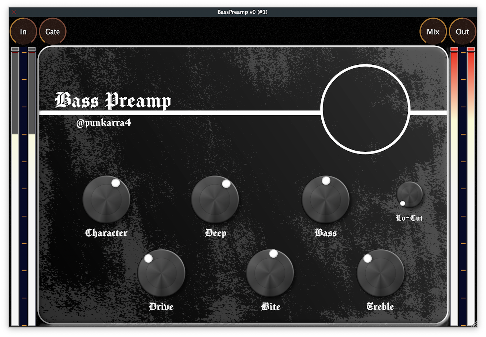

# BassPreamp
 

## Introduction
This is a VST3/AU bass preamp plugin made with [JUCE](https://juce.com/). My goal is blending together ideas and concepts from multiple bass preamps effects into one single processor.

**--- THERE WILL BE A VIDEO LINK HERE WHEN THE DEMO IS READY ---**

## Actual state of this repository
This project is in a very early state. You may find below a list of features to be implemented:
* **DSP**:
    * `Character` control is one-knob processor that shapes the EQ curve in the input.
    * `Drive` adjusts the input gain and mix of a tube emulation saturator.
    * `Comp` adjusts the input gain and mix of a compressor running in series after the saturator.
    * `Pump` adjusts the inpout gain and mix of a compressor runing in parallel after the saturator.
    * `Bass`, `Treble` and `Lo-Cut` implement a low-shelf, hi-shelf and hi-pass filters at the end of the chain.
* **Extras**:
    * I should implement a `PresetManager`...
* **Documentation**:
    * Documentation is boring so I procastinate a little in that matter, but I promise to get it done and nicely presented once the project is near completion... 

## Inner Processing
To be done...
